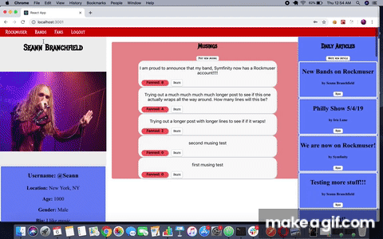

## Rockmuser

Welcome to Rockmuser! Rockmuser is an app that seeks to solve the issue of social media sites not connecting bands and musicians to their fans in an efficient manner. Users in Rockmuser sign up for either musician or fan accounts. Users may post musings which stay on their profile page much like a "wall" or they may post articles which appear in everyone's "feed". Fan accounts may browse and follow musician accounts but musician accounts may only see the fans that connect to them. However, musicians may also set a profile video (as a YouTube embed). Users may also log in and log out as well as upload profile photos using Active Storage via AWS.

### Features

**-Users have accounts and can log in and out of the app**

**-All users may have profile photos.**

**-Bands/Musicians may have music videos on their profile.**

**-Users may post musings to their own profile and other users can "fan" their musings.**

**-Users may post articles which are browsable by other users by their headlines.**

### Development

Rockmuser was built using a Rails backend and React.js/Redux frontend. It uses JWT for authentication, Active Record for profile photos, and Google Font API for styling.

*This app was made by Seann Branchfield*
